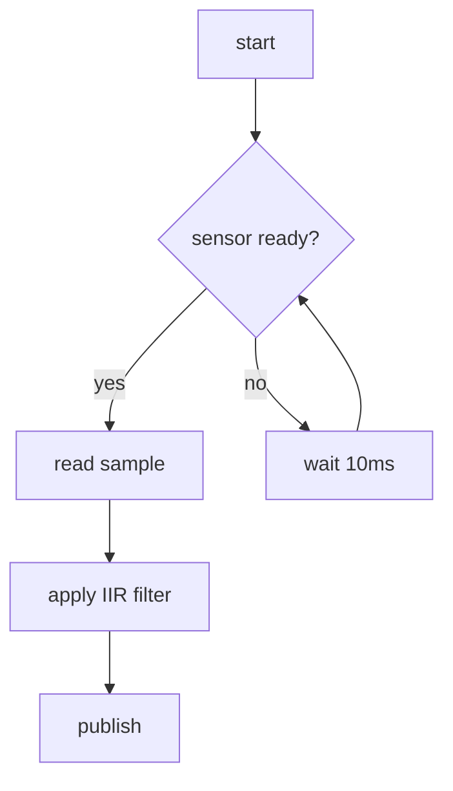

# 코드 작업 지침 (Coding SOP) — Self-Contained

코드 작성·수정 시 **방법론**·**문서 구조**·**문서 양식**·**종료 게이트**의 단일 근원(SSOT). 본 파일 1개로 자체 완결 (기술 부채는 별도 SSOT). HANDOFF_coding_md.md §2 의 14개 설계 결정 모두 반영.

## 설치 위치

- **본 파일**: 대상 프로젝트의 `docs/claude_guideline/coding.md` 에 배치
- 본 파일이 위 경로에 없으면 본 SOP 는 활성화되지 않는다. 새 프로젝트 적용 시 본 파일을 위 경로로 복사하는 것이 첫 단계.
- 외부 의존 SSOT: 기술 부채만 [tech_debt.md](tech_debt.md) (정공법·우회 3조건). 그 외 모든 규칙은 본 파일에 자체 완결.

## 모토 — 세 부채를 누적시키지 않는다

코드를 진전시킬 때 다음 셋을 동시에 점검:

- **기술 부채** — 동작은 하나 미래 비용을 만드는 결함
- **이해 부채** — "이 코드가 무엇을 하는가?" 미응답
- **의도 부채** — "왜 이렇게 만들었는가?" 미응답

기술 부채의 정공법·우회 3조건은 [tech_debt.md](tech_debt.md) 참조.

---

## 0. 표준 디렉토리 트리 (★ 자체 완결)

### 0.1 ROS2 워크스페이스

```text
workspace/
├── src/
│   └── <pkg>/
│       ├── package.xml
│       ├── docs/                       ← 패키지별 문서 (권위 가까이)
│       │   ├── functions/              ← 함수 리스트 (§9.1)
│       │   ├── variables.md            ← 전역/공유 변수 (§9.2)
│       │   ├── flow/                   ← Mermaid flowchart (§9.3)
│       │   ├── decisions/              ← ADR (§9.4)
│       │   ├── checklists/             ← 종료 체크리스트 (§9.5)
│       │   └── glossary.md             ← 도메인 용어집
│       └── ...
└── docs/                               ← 프로젝트 루트 집계
    ├── summary.md
    ├── functions_index.md              ← 자동 집계 (CI 강제)
    ├── variables_index.md              ← 자동 집계
    ├── decisions/                      ← 프로젝트 전반 ADR
    ├── checklists/                     ← 다중 모듈 PR 체크리스트
    ├── flow/system_overview.mmd
    └── claude_guideline/coding.md      ← 본 파일
```

### 0.2 Non-ROS2 프로젝트

```text
project/
├── <module>/
│   ├── docs/                           ← 모듈별 (functions/, variables.md, flow/, decisions/, checklists/, glossary.md)
│   └── ...
└── docs/                               ← 프로젝트 루트 집계 (functions_index.md, variables_index.md, decisions/, checklists/, flow/)
```

### 0.3 작은 프로젝트 예외

< 5 파일 또는 < 1000 LOC → 평면 `docs/` 만 (모듈별 분리 면제).

### 0.4 표준 폴더 권위 표

| 폴더 / 파일 | 역할 | 본 SOP 참조 |
|---|---|---|
| `docs/functions/` | 함수 리스트 (모듈) | §1.3, §9.1 |
| `docs/variables.md` | 전역/공유 변수 리스트 | §9.2 |
| `docs/flow/` | Mermaid flowchart | §2 단계 1, §9.3 |
| `docs/decisions/` | ADR (모듈 한정) | §1.2, §9.4 |
| `docs/checklists/` | 종료 체크리스트 | §7, §9.5 |
| `docs/glossary.md` | 도메인 용어집 | §7 B |
| `docs/functions_index.md` | 자동 집계 (CI 강제) | §0.5 |
| `docs/variables_index.md` | 자동 집계 | §0.5 |

### 0.5 인덱스 자동 생성 (★ 강제)

`functions_index.md`, `variables_index.md` 는 빌드 / pre-commit / CI 에서 자동 재생성. 도구 자유 (Python 스크립트, Doxygen, ctags 등). **인덱스 stale 시 CI 차단.**

---

## 1. 원칙

### 1.1 금지 / 수정 / 상수

- 사전 승인 없이 외부 인터페이스·빌드 시스템·하드웨어·스키마·패키지 의존성 변경 금지
- 매직 넘버 금지 → 상수 분리. 이름은 단위·물리량 포함 (`timeout_ms`, `distance_mm`, `angle_rad`)
- 절대 경로 하드코드 금지 (허용: 빌드 시스템 변수, 사용자 입력, 로그 표시)

대안 API: `QCoreApplication::applicationDirPath()`, `QStandardPaths::AppDataLocation`, `pathlib.Path(__file__)`, 환경 변수.

### 1.2 사전 승인 트리거 (14개)

1개라도 충족 시 코딩 전 사용자 승인 + ADR (§9.4) 작성.

| 분류 | 트리거 |
|---|---|
| 기존 5 | 패키지 의존성 / 외부 인터페이스 / 빌드 시스템 / 하드웨어 인터페이스 / 데이터 스키마 |
| 신규 9 | 새 IPC 채널 / 새 `.ui` 파일 / C++↔Python 경계 함수 / 절대경로 불가피 / 동시성·스케줄링 / 타이밍 파라미터 / 로그 포맷·레벨 / 좌표계·단위계 / 공개 함수 신설 (private helper 면제) |

### 1.3 함수 중복 방지 강제 게이트 (★ 핵심)

새 함수 작성 **전** 함수 리스트 검토 의무. 미통과 시 코딩 진행 불가.

3단계 모듈 인지 검색: ① 현재 모듈 `docs/functions/` → ② 프로젝트 `docs/functions_index.md` (자동 집계) → ③ 모듈 이동/추출 판정 (shared util 로?).

| 일치도 | 처리 |
|---|---|
| 완전 동일 | 기존 함수 사용. 신규 금지 |
| 시그니처만 다름 | 오버로드 / 기본 인자 통합 |
| 알고리즘 동일, 도메인 다름 | 일반화 후 양쪽 호출 (외부 인터페이스 변경 시 사전 승인) |
| 입출력 유사, 구현 전략 다름 | 사용자에게 결정 요청 |
| 개념만 비슷 | 신규 허용, 키워드 차별화 |

면제: 1줄 wrapper / getter-setter / 언어 경계 bridge / 단위테스트 fixture / Qt 자동 슬롯.

보고 의무: 검토 결과 1줄. 예) "검색 키워드: lowpass, iir / 동일 기능 없음 → 신규".

### 1.4 매뉴얼 / 데이터시트 인용 (★ 자체 완결)

하드웨어 통신, 페리페럴 설정, 외부 라이브러리 API 사용 시:

- **추정 금지** — 매뉴얼·데이터시트 원문 인용 의무
- 인용 형식: `<제목> p.<페이지> §<절>` (예: `STM32F4 Reference Manual p.214 §10.3.2`)
- 매뉴얼 사본은 `docs/manuals/<제목>_v<버전>.pdf` 에 보관 (대용량 시 git-lfs 또는 외부 링크 + 핵심 페이지 발췌)
- 검증 등급:
  - **L1 실측** — 오실로스코프·로직 애널라이저·테스트 통과
  - **L2 매뉴얼 인용** — 페이지·절 명시
  - **L3 추정** — ★ 금지. 작성 즉시 L1 또는 L2 로 격상

---

## 2. 코딩 워크플로우 + 시작/종료 체크리스트

### 2.1 작업 시작 전 (★ 자체 완결)

- [ ] 사용자 요청 원문 기록 (`docs/user_instructions/user_instructions.md` 가 있으면 추가, 없으면 commit body)
- [ ] 작업 범위 명확 (단일 파일 / 모듈 / 다중 파일)
- [ ] 사전 승인 트리거 §1.2 판정 (해당 시 ADR 먼저)
- [ ] 함수 리스트 검토 §1.3 통과 (강제 게이트)
- [ ] 변수 테이블 검토 (전역/공유 — `docs/variables.md`)
- [ ] 영향 범위 — 다른 모듈 / 외부 인터페이스
- [ ] 이슈 / PR 연결 (있으면)

### 2.2 12단계 워크플로우

```text
1.  Flowchart 작성/갱신 (§9.3)           [이해]
2.  필요 함수 식별 + 이슈 연결           [의도]
3.  ★ 함수 리스트 검토 (§1.3 게이트) ★  [기술]
4.  변수 테이블 검토 (전역/공유)         [이해]
5.  사전 승인 트리거 판정 → ADR (§9.4)   [의도]
6.  SHIL 테스트 작성 (§5 Test-Together)  [기술]
7.  함수 구현 (formatter §4.1 적용)      [기술]
8.  SHIL 통과 + 빌드 + lint              [기술]
9.  모듈 docs 동기화 + 인덱스 재생성     [이해]
10. 수정 이력 갱신 (§6 L1~L4 차등)       [의도]
11. ★ 종료 체크리스트 §7 (게이트) ★     [세 부채]
12. 보고 §9.6 (체크리스트 링크 + 1줄)    [의도]
```

**3·11 미통과 시 차단** — 다른 단계로 진행 불가.

### 2.3 작업 종료 전 (★ 자체 완결)

- [ ] §7 부채별 체크리스트 작성 (`docs/checklists/{id}.md`)
- [ ] 빌드 통과 (펌웨어는 cross-compile + flash 검증)
- [ ] SHIL 테스트 통과
- [ ] Formatter / lint 통과
- [ ] 함수 / 변수 / flowchart 문서 동기화
- [ ] 인덱스 자동 재생성 통과 (§0.5)
- [ ] 수정 이력 §6 갱신
- [ ] 보고 작성 §9.6

---

## 3. 언어 / 아키텍처

### 3.1 언어 선택

| 영역 | 언어 |
|---|---|
| 알고리즘 / 제어 / 수치 / 하드웨어 통신 | C/C++ |
| UI | PyQt5 (디폴트). 프로젝트 요청 시 PyQt6 / PySide6 전환 |
| UI ↔ 알고리즘 어댑터 | Python (얇은 wrapper) |
| 간단 스크립트 / 자동화 / 후처리 | Python |

Qt 바인딩 선택지:
- **PyQt5** (디폴트) — GPL/상용. Qt 5.15 LTS
- **PyQt6** — Qt 6 신기능. GPL/상용
- **PySide6** — Qt 6 신기능. **LGPL** (폐쇄 상용 친화)

### 3.2 UI / 알고리즘 분리 (MVP)

| 계층 | 책임 | 위치 | 언어 |
|---|---|---|---|
| **View** | 위젯·이벤트만 | `views/` | Python |
| **Presenter** | View ↔ Model 중재 | `presenters/` | Python |
| **Model (알고리즘)** | 도메인 로직, PyQt 의존 없음 | `src/` | C/C++ |
| **Bridge** | C++ Model wrapper | `bridge/` | Python |

강제:
- View 내 알고리즘 코드 금지
- `.ui` 파일은 `ui/` 폴더
- 변환 (`pyuic5/6`, `pyside6-uic`) 은 빌드 단계 자동 + gitignore

### 3.3 C++ ↔ Python IPC (프로젝트별 결정)

선택지: pybind11 / ZeroMQ / gRPC / ROS / shared memory / MQTT-NATS.

선택 체크리스트: 실시간성·데이터 크기·크래시 격리·배포 형태·기존 자산.

| 조건 | 권장 |
|---|---|
| < 1ms + 대용량 | shared memory |
| 10ms + 동일 PC + 격리 필요 | ZeroMQ |
| 10ms + 동일 PC + 격리 무관 | pybind11 |
| 강타입 RPC | gRPC |
| ROS 기반 | ROS topic/service |

새 IPC 채널 추가는 사전 승인 트리거 (§1.2).

---

## 4. 구현 표준

### 4.1 Formatter

- **C/C++**: `clang-format` `BasedOnStyle: Microsoft`
- **Python**: **Ruff** (`ruff format` + `ruff check`, black/isort/flake8 통합)
- pre-commit hook 자동 적용
- 기존 코드 일괄 reformat 은 **단독 PR** 로 분리

### 4.2 명명

- snake_case 통일
- 함수: `domain_action_object` (예: `image_filter_apply`)
- 상수: `UPPER_SNAKE_CASE`
- 타입: `PascalCase`
- 단위 접미사 권장: `timeout_ms`, `distance_mm`, `angle_rad`

### 4.3 경로

코드 내 절대 경로 하드코드 금지. 허용: 빌드 시스템 변수, 사용자 입력, 로그 표시.

대안 API:
- C++ Qt: `QCoreApplication::applicationDirPath()`, `QStandardPaths::AppDataLocation`
- Python: `pathlib.Path(__file__).resolve().parent`
- 환경 변수 / config 파일

### 4.4 플랫폼

- 경로 구분자 `/` 통일
- 소스는 UTF-8 / Windows API 호출 시 UTF-16 wstring
- 한글 사용자명 경로 대응

---

## 5. 검증 — SHIL Test-Together

함수 작성 시 SHIL (Software/Hardware-in-the-Loop) 테스트 동반 (엄격 TDD 아님).

| 강제 | 면제 |
|---|---|
| 비자명 로직 / 하드웨어 인터페이스 / 안전 분기 | getter-setter / 1줄 wrapper / 로깅 / Qt 자동 슬롯 |

언어별:
- **C/C++**: GoogleTest
- **Python**: pytest
- **PyQt UI**: pytest-qt

---

## 6. 수정 이력 4계층

| L | 위치 | 갱신 임계 |
|---|---|---|
| **L1** | Git commit (권위) | 모든 변경. **Conventional Commits** (`feat:`, `fix:`, `refactor:`, ...) |
| **L2** | `CHANGELOG.md` | PR 머지. **Keep a Changelog** |
| **L3** | 파일 헤더 / 사이드카 | **외부 동작·시그니처 변경 시만** |
| **L4** | 함수 `@history` | 50줄+ 또는 안전 관련 함수만 |

L3 형식(인라인 vs 사이드카)은 프로젝트별 결정. 주석 최소화 원칙은 일반 주석에만 — `@history`, `@brief`, `@param` 등 메타 태그는 면제.

차등 갱신:

| 변경 | L1 | L2 | L3 | L4 |
|---|---|---|---|---|
| 오타 / 주석 / 포매팅 | ✅ | — | — | — |
| 단일 파일 버그 수정 | ✅ | ✅ | — | — |
| 시그니처 / 알고리즘 / 신규 | ✅ | ✅ | ✅ | ✅ |
| 리팩터 (외부 불변) | ✅ | 선택 | — | — |

Conventional Commits 예:

```text
feat(filter): add IIR lowpass coefficient generator

함수 image_filter_iir_design() 신설. 함수 중복 검사: lowpass / iir 키워드 검색 → 없음.
사전 승인 트리거: 공개 함수 신설 → ADR docs/decisions/0042-iir-filter.md.

Closes #123
```

---

## 7. 종료 체크리스트 (★ 부채별)

### A. 기술 부채 방지
- [ ] Formatter 통과 (clang-format / ruff)
- [ ] 절대 경로 없음
- [ ] 매직 넘버 → 상수 분리
- [ ] 함수 중복 검사 §1.3 게이트
- [ ] SHIL 테스트 통과
- [ ] 빌드 · lint · 회귀 통과
- [ ] TODO 등록 (workaround → [tech_debt.md](tech_debt.md))

### B. 이해 부채 방지
- [ ] 함수 리스트 갱신 (`docs/functions/`, §9.1)
- [ ] 변수 리스트 갱신 (`docs/variables.md`, §9.2)
- [ ] Flowchart 갱신 (`docs/flow/`, §9.3)
- [ ] 명명 컨벤션 §4.2
- [ ] 용어집 (`docs/glossary.md`) 동기화
- [ ] 진입점 명시 (다중 시 path 별 분리)
- [ ] 단위·좌표계 명시

### C. 의도 부채 방지
- [ ] 변경 사유 commit body 에 기재
- [ ] ADR (`docs/decisions/`, §9.4) — 사전 승인 트리거 §1.2 시 필수
- [ ] 대안 검토 기록 (ADR 내)
- [ ] 이슈 / PR 링크
- [ ] workaround 는 [tech_debt.md](tech_debt.md) 등록
- [ ] 수정 이력 §6 (L1~L4)

### D. 위반 / 예외 / 인계
위반 항목·사유·후속 명시. 무위반이면 "위반 없음" 한 줄.

### 적용 범위 자동 판정

| 범위 | 조건 |
|---|---|
| **Full** | 신규 공개 함수 / 시그니처 변경 / 사전 승인 트리거 / 5+ 파일 |
| **Minimal** | 단일 파일 버그 / 5줄 이하 |
| **Docs-only** | 문서만 |

사람 격상 가능.

### 저장 4계층

- 글로벌 `CLAUDE.md`: 원칙 (본 문서 링크)
- `docs/checklists/{id}.md`: **산출물 권위 (단일 진실)**. 명명: `PR-{번호}-{slug}.md` 또는 `{date}-{slug}.md`
- PR 본문: 사본
- Git commit: 1줄 요약 + PR / 파일 링크

**False 항목 처리**: 합법 N/A / 의도 위반 (→ [tech_debt.md](tech_debt.md)) / 누락 (재체크) / 인프라 부재 (보고). **거짓 ✅ = 작업 무결성 위반.**

---

## 8. 프로젝트별 결정 항목 (14개, 시작 시 인터뷰)

신규 프로젝트 시작 시 코딩 전에 결정·기록. 결과는 프로젝트 `CLAUDE.md` 또는 `docs/decisions/0001-project-baseline.md` 에.

| # | 항목 | 예시 |
|---|---|---|
| 1 | 타깃 플랫폼 | Linux x86_64 / Windows / STM32F4 / Ubuntu 22.04 ROS2 Humble |
| 2 | IPC 방식 §3.3 | pybind11 / ZeroMQ / shared memory / ROS topic |
| 3 | 빌드 시스템 | CMake / colcon / Meson / setup.py / pyproject.toml |
| 4 | 테스트 프레임워크 | GoogleTest / pytest / pytest-qt |
| 5 | Qt 바인딩 | PyQt5 / PyQt6 / PySide6 |
| 6 | 함수 레지스트리 형식 | YAML / Markdown 표 / Doxygen |
| 7 | 카테고리 분류 | 도메인 / 계층 / 자유 |
| 8 | 모듈 경계 | ROS2 패키지 / 모놀리스 모듈 / 평면 |
| 9 | L3 수정 이력 형식 | 인라인 헤더 / 사이드카 `.history.md` |
| 10 | 라이선스 | GPL / LGPL / MIT / 사내 비공개 |
| 11 | Python · Qt 버전 | 3.10 / Qt 5.15 LTS |
| 12 | pyuic 산출물 처리 | 빌드 자동 + gitignore / 수동 commit |
| 13 | 인덱스 도구 | Python 스크립트 / Doxygen / ctags |
| 14 | CI 자동화 | GitHub Actions / GitLab CI / Jenkins |

---

## 9. 문서 양식 (★ 자체 완결)

### 9.1 함수 리스트 양식

위치: `docs/functions/<module>.md` (모듈별) 또는 `docs/functions/<file>.yaml` (파일별).

YAML 양식 (12 필드):
```yaml
- name: image_filter_iir_design
  signature: "int image_filter_iir_design(double fc, double fs, IIRCoef* out)"
  location: src/filter/iir.c:42
  category: signal_processing
  purpose: IIR lowpass coefficient generator
  inputs: "fc [Hz], fs [Hz]"
  outputs: "IIRCoef* (a/b coefficients)"
  side_effects: "none"
  thread_safe: true
  preconditions: "0 < fc < fs/2"
  postconditions: "out->a/b filled, return 0 on success"
  history:
    - "2026-05-16: created (#123)"
```

Markdown 표 양식 (간이):

| # | 함수 | 입력 | 출력 | 기능 | 위치 |
|---|---|---|---|---|---|
| 1 | `image_filter_iir_design` | fc, fs | IIRCoef* | IIR lowpass 계수 생성 | `iir.c:42` |

### 9.2 변수 리스트 양식

위치: `docs/variables.md` (모듈별).

| # | 변수 | 종류 | 단위 / 좌표계 | 사용처 (함수) | 위치 |
|---|---|---|---|---|---|
| 1 | `SAMPLE_RATE_HZ` | 상수 | Hz | filter_*, dsp_* | `config.h:12` |
| 2 | `g_sensor_state` | 가변 (전역) | — | sensor_update, sensor_read | `sensor.c:8` |

전역 변수 / 모듈 상수 없으면 "전역 변수 / 모듈 상수 없음" 한 줄.

### 9.3 Flowchart (Mermaid)

위치: `docs/flow/<topic>.mmd`.



다중 진입점 (예: offline / live, CLI / library) 은 path 별 분리 + 공통 호출 그래프 별도.

### 9.4 ADR 양식 (1페이지)

위치: `docs/decisions/{NNNN}-{slug}.md`. 사전 승인 트리거 §1.2 충족 시 의무.

```markdown
# ADR-0042: IIR 필터 도입

- **Status**: Accepted
- **Date**: 2026-05-16
- **Deciders**: @user, @claude

## Context
센서 노이즈가 5kHz 이상에서 두드러져 제어 루프에 jitter 유발.

## Decision
IIR 2차 lowpass 필터 (Butterworth, fc=2kHz) 적용.

## Reason
- FIR 대비 계산량 1/4 (제어 루프 5kHz 에서 안정)
- 위상 지연 < 0.5ms 허용 범위 내

## Alternatives
1. **FIR (Hamming)** — 위상 선형이나 계산량 과다
2. **이동 평균** — 컷오프 정밀도 부족
3. **하드웨어 RC 필터** — 추가 회로 비용

## Result
- 함수 `image_filter_iir_design()` 신설 (§9.1)
- SHIL 테스트: `test_iir_design.cpp`
- 후속: 다른 센서 적용 시 fc 재튜닝 필요
```

### 9.5 종료 체크리스트 양식

위치: `docs/checklists/PR-{번호}-{slug}.md` 또는 `{date}-{slug}.md`.

```markdown
# 체크리스트: PR-123 IIR 필터 도입

- **적용 범위**: Full
- **PR**: #123
- **Date**: 2026-05-16

## A. 기술 부채 방지
- [x] Formatter (clang-format Microsoft)
- [x] 절대 경로 없음
- [x] 매직 넘버 → 상수 (`IIR_FC_HZ`, `IIR_FS_HZ`)
- [x] 함수 중복 검사: 키워드 "iir, lowpass" → 동일 기능 없음
- [x] SHIL: `test_iir_design.cpp` 통과
- [x] 빌드 / lint / 회귀 통과
- [x] TODO 없음

## B. 이해 부채 방지
- [x] `docs/functions/filter.md` 갱신
- [x] `docs/variables.md` 갱신 (IIR_FC_HZ 등)
- [x] `docs/flow/control_loop.mmd` 갱신
- [x] 명명: `image_filter_iir_design` (domain_action_object)
- [x] 용어집: "IIR" 추가
- [x] 진입점 단일
- [x] 단위: Hz 명시

## C. 의도 부채 방지
- [x] commit body 사유 기재
- [x] ADR docs/decisions/0042-iir-filter.md
- [x] 대안 3개 검토 (ADR 내)
- [x] 이슈 #100 링크
- [x] workaround 없음
- [x] L1/L2/L3/L4 갱신

## D. 위반 / 예외 / 인계
위반 없음.
```

### 9.6 보고 양식

작업 종료 시 1~2줄 + 체크리스트 링크:

```text
변경: <파일 N개 / 함수 M개 / ADR K건>
감지된 도메인: ros2, concurrency (또는 없음 — §10)
검토: 함수 리스트 §1.3 통과 (키워드: iir, lowpass / 동일 없음) / 사전 승인 트리거 §1.2 — 공개 함수 신설 → ADR-0042
체크리스트: docs/checklists/PR-123-iir-filter.md (Full)
후속 TODO: 없음 (또는 tech_debt.md 링크)
```

---

## 10. 도메인 확장 인터페이스 (★ Plug-in 5요건)

도메인별 특화 룰(ROS2 / 임베디드 / 동시성 등)은 본 폴더 내 별도 파일로 plug-in. 본 README 가 공통 규칙·인터페이스를 정의하고, 도메인 파일이 인벤토리·룰·체크리스트 항목을 추가한다.

### 10.1 도메인 파일 위치 · 명명

- 위치: `coding/<domain>.md` 단일 파일 또는 `coding/<domain>/README.md` 폴더 (서브-도메인 재귀 §10.6)
- 명명: 단일 단어 소문자 (`ros2`, `embedded`, `concurrency`, `web`, `ml`)

### 10.2 자동 감지 트리거

| 도메인 | 트리거 (1개 이상 충족 시 활성) |
|---|---|
| **ros2** | `package.xml`, `rclpy`/`rclcpp` import, `.launch.py`, `rcl_interfaces`, `ament_python`/`ament_cmake` |
| **embedded** | `__attribute__((interrupt))`, `ISR(`, `NVIC_`, `IRQHandler`, FreeRTOS API, STM32 HAL, `.ld` linker, register-level access, `volatile` 빈출 |
| **concurrency** | `threading`, `asyncio`, `std::thread`, `std::mutex`, `MutuallyExclusiveCallbackGroup`, `ReentrantCallbackGroup`, multi-callback, `async def` / `await` |

다중 도메인 동시 활성 가능. 우선순위 없음. 사용자 명시 지정 시 그것 우선 (자동 감지 무력화는 사용자 명시 거부 시에만).

### 10.3 도메인 파일 등록 5요건

새 도메인 파일은 다음 5요건 모두 만족해야 SSOT 등록:

1. **트리거** — 자동 감지 키워드 / 파일 패턴 (1개 이상). 다른 도메인과 중복 시 모두 활성
2. **추가 룰** — 본 README §1~§9 와 충돌 없이 도메인 특화 항목 (예: ROS2 QoS 호환성, 임베디드 ISR 룰)
3. **추가 종료 체크리스트 항목** — §7 A/B/C/D 골격에 도메인별 항목 첨가
4. **자체 점검 grep** — 도메인 표 헤더 + 룰 식별자 검출 정규식
5. **다른 도메인과의 의존 / 충돌 명시** — 동시 활성 시 룰

### 10.4 활성 도메인 명시 의무

종료 체크리스트 §9.5 와 보고 §9.6 에 활성 도메인 명시: `감지된 도메인: ros2, concurrency` (또는 `없음`).

### 10.5 공통 vs 도메인 분담선

| 본 README (공통, 모든 프로젝트) | 도메인 파일 (자동 감지 시) |
|---|---|
| 디렉토리 트리 §0 / 함수 게이트 §1.3 / 사전 승인 트리거 §1.2 / formatter §4 / 수정 이력 §6 / 종료 체크리스트 골격 §7 | 도메인 특화 인벤토리 (QoS·ISR·동기화 객체) / 도메인 룰 / 추가 체크리스트 항목 / 자체 점검 grep |

새 도메인 추가 시 본 README 수정은 §10.2 트리거 표 한 줄 추가만. 그 외 본 README 불변 — 도메인 파일 plug-in 으로 흡수.

### 10.6 서브-도메인 재귀 (향후 확장 — 근거만 명시)

도메인 룰이 풍부해지면 (예: `embedded` → MCU 별 페리페럴·HAL·툴체인이 매우 다름) 단일 파일 대신 폴더로 확장 가능:

```text
coding/<domain>/
├── README.md           ← 도메인 공통 룰 (ISR / WCET / volatile 등)
├── <sub-a>.md          ← 서브-도메인 특화 (예: aurix, arduino, stm32, esp32)
└── <sub-b>.md
```

확장 규칙:

- 5요건 §10.3 은 서브-도메인에도 **동일 적용**
- 서브 트리거는 `<domain>/README.md` 의 §10.2 에 자체 등록. 본 README §10.2 는 **도메인 레벨만**
- 다중 서브 동시 활성 가능 (예: `aurix + concurrency`)
- 본 README 는 도메인 폴더 진입점만 알면 충분 — **폴더 내부 구조 변경은 본 README 불변**
- 적용 후보 (향후 추가 시점에 등록): `embedded/{aurix, arduino, stm32, esp32}`, `web/{frontend, backend}`, `ml/{vision, nlp}` 등

본 절은 확장 가능 근거만 명시. 실제 서브-도메인 파일은 필요 시점에 별도 작성.

---

## 룰 (요약)

1. **세 부채 모토** — 기술·이해·의도 동시 점검
2. **함수 중복 방지 게이트 §1.3** — 검색 → 결정 매트릭스 → 1줄 보고. 미통과 시 코딩 불가
3. **12단계 워크플로우 §2.2** — 3·11 강제 게이트
4. **사전 승인 트리거 14개 §1.2** — 1개라도 충족 시 ADR (§9.4)
5. **MVP 분리 §3.2** — View 내 알고리즘 금지
6. **Formatter §4.1** — clang-format Microsoft / Ruff
7. **수정 이력 4계층 §6** — Conventional Commits + Keep a Changelog
8. **종료 체크리스트 §7** — 부채별 A/B/C/D + 적용 범위 자동 판정
9. **매뉴얼 인용 §1.4** — 추정 금지, L1 실측 또는 L2 매뉴얼 인용
10. **인덱스 자동 생성 §0.5** — stale 시 CI 차단
11. **거짓 ✅ 금지** — 작업 무결성 위반
12. **기술 부채만 외부 SSOT** — workaround 는 [tech_debt.md](tech_debt.md) 등록
13. **도메인 확장 §10** — Plug-in 5요건 충족. 새 도메인은 `coding/<domain>.md`. 본 README 수정은 §10.2 트리거 표 한 줄만
