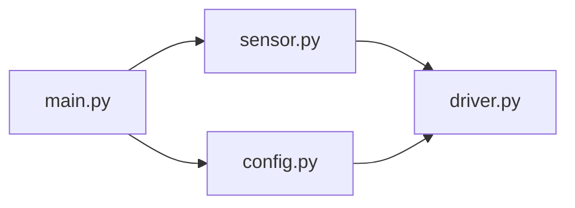
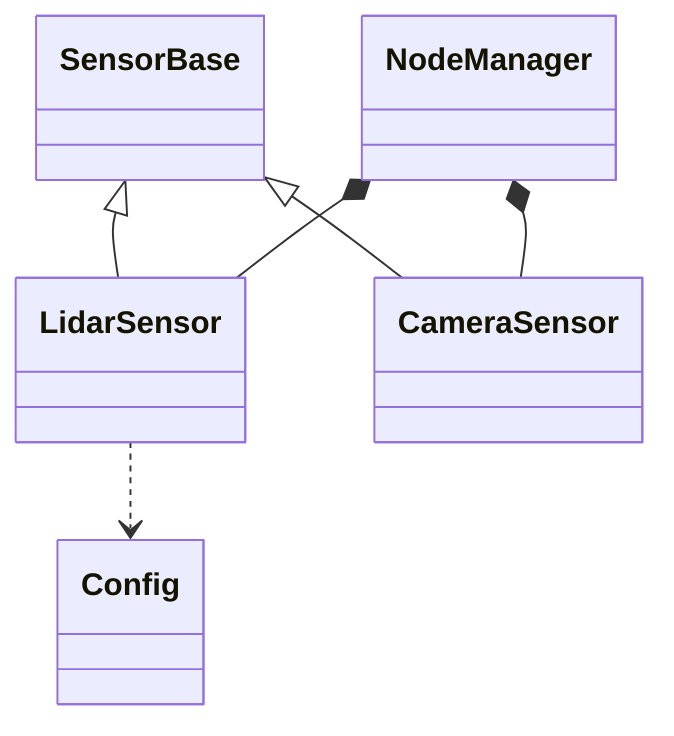
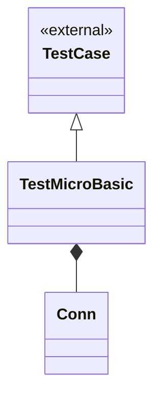
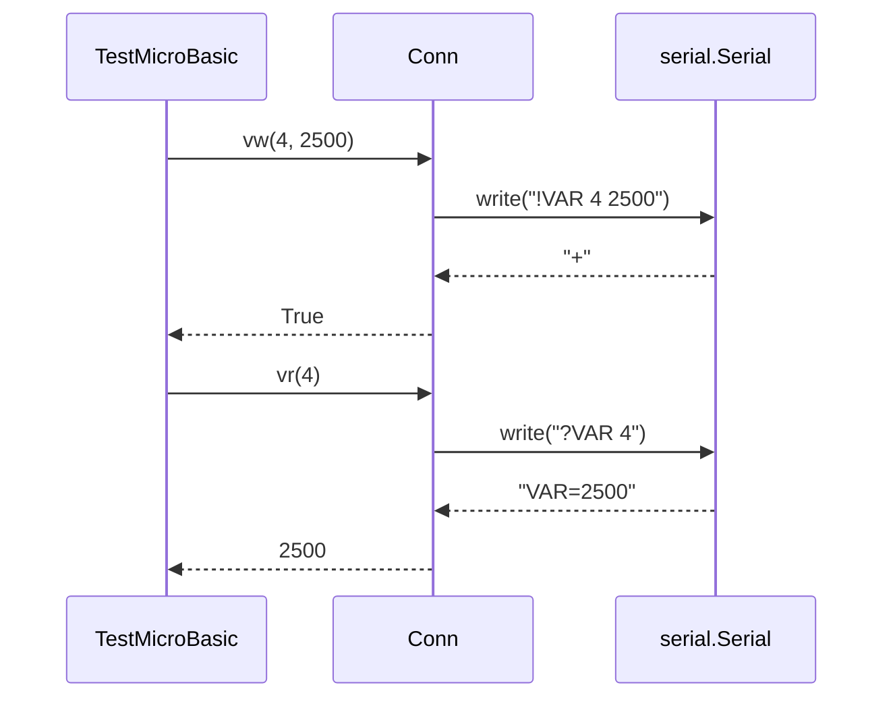
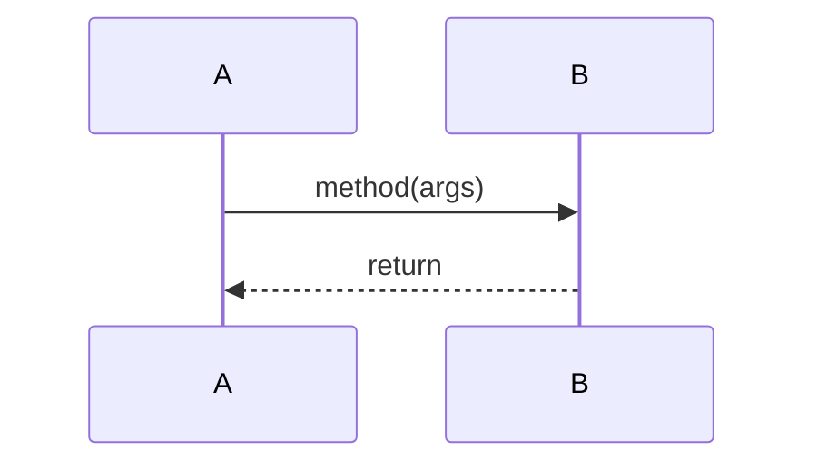

# SW 구조 분석 작업 지침 (SW Structure Analysis SOP)

여러 파일·클래스가 서로 **어떻게 연결되는지 보여주는** 분석의 방법론과 기록 형식의 단일 근원(SSOT / Single Source of Truth).

SW(Software) 구조 분석의 목적은 코드의 결함·품질 판정이 아니라 **연결 관계의 시각화**다 — 누가 누구를 import / include / 상속 / 구성 / 호출하는지를 그래프·관계도·표로 드러낸다. 결함·severity·SOLID 같은 품질 평가는 본 SOP(Standard Operating Procedure)의 범위가 아니며 code_review SOP 로 위임한다.

## 설치 위치

- **본 파일**: 대상 프로젝트의 `docs/claude_guideline/sw_structure.md` 에 배치
- **분석 산출물**: `docs/sw_structure/<주제>.md` 에 기록 (대상 프로젝트 루트 기준 상대경로)

본 파일이 `docs/claude_guideline/sw_structure.md` 위치에 없으면 본 SOP 는 활성화되지 않는다 — 트리거 키워드가 감지되어도 룰 적용 불가. 새 프로젝트 적용 시 본 파일을 위 경로로 복사하는 것이 첫 단계.

## 트리거

사용자 메시지에 다음 키워드 등장 시:

- "SW 구조", "소프트웨어 구조", "구조 보여줘", "구조 분석"
- "파일 관계", "파일이 어떻게 연결", "의존 관계", "import 관계"
- "클래스 관계", "클래스 다이어그램", "상속 구조", "클래스가 어떻게 연결"
- "모듈 연결", "호출 관계", "콜 그래프"
- 디렉토리 / 패키지를 첨부하며 "어떻게 엮여 있는지" 류 질문

## 코드 리뷰와의 경계 (중복 차단)

| 질문 | 담당 SOP |
|------|---------|
| "이 파일·클래스가 **무엇과 어떻게 연결되는가**" (import·상속·구성·호출) | **본 SOP (SW 구조)** |
| "이 코드가 **맞고 깨끗한가**" (결함·severity·SOLID·성능·스타일) | code_review SOP |
| 함수 단위 입출력·로직 결함 | code_review SOP 로 위임 |

본 SOP 는 **연결을 보여주는 것**까지만 한다. 연결 위에서의 품질 판정(과결합·계층 위반 등 가치 평가)은 하지 않는다. 단, 순환 의존·고립 노드 같은 **구조적 사실**은 판정 없이 기록한다 (§Core 산출물 ④ 구조 관찰).

## 흐름도 (한눈에)

```
[SW 구조 분석 요청 도착]
   ↓
[Step 1] 대상 범위 식별           ────→  ✓ 파일/디렉토리/패키지/모듈 집합 확정
   ↓
[Step 2] 산출물 분기 판정         ────→  ✓ 파일 그래프만 / 클래스 관계도만 / 둘 다
   ↓
[Step 3] 연결 추출 (실측)         ────→  ✓ import·include·상속·구성·호출 grep/LSP 실측
   ↓
[Step 4] 파일 의존 그래프 작성    ────→  ✓ 방향 그래프 (mermaid)
   ↓
[Step 5] 클래스 관계도 작성       ────→  ✓ 클래스 존재 시 UML 스타일 관계도 (mermaid)
   ↓
[Step 6] 시퀀스 다이어그램 작성   ────→  ✓ 실행 시나리오별 객체 호출 순서 (mermaid)
   ↓
[Step 7] 연결 관계표 작성         ────→  ✓ source→target·관계 종류·위치(file:line)
   ↓
[Step 8] 구조 관찰 (사실만)       ────→  ✓ 순환·고립·진입점 수, 판정 없음
   ↓
[Step 9] docs/sw_structure/<주제>.md 기록 ────→  ✓ KST 시각, user_instructions.md 매핑
   ↓
[Step 10] 자체 점검 grep          ────→  ✓ 그래프 블록·관계표 헤더·관계 종류 통과
   ↓
[Step 11] 1~2 줄 결과 보고        ────→  ✓ 변경 파일 / 후속 TODO 명시
   ↓
[완료]
```

---

## Core 산출물 (5 항목 — 누락 0)

### ① 파일 의존 그래프

대상 파일들이 서로 무엇을 import / include / 호출하는지 **방향 그래프**로 표시. mermaid `flowchart` 사용 (렌더링 가능). 노드 = 파일, 화살표 = "왼쪽이 오른쪽에 의존".



- 노드 라벨은 **파일명** (동명 파일 충돌 시 상대경로로 구분)
- 외부 라이브러리 의존은 그래프에 포함하지 않음 (내부 파일 연결만 — 외부 의존은 code_review 의존성 표 소관). 단 진입점 식별에 필요하면 외부를 점선 `-.->` 로 별도 표기.
- 그래프가 30 노드를 넘으면 디렉토리/서브패키지 단위로 그룹(`subgraph`) 분할.

### ② 클래스 관계도

클래스가 존재하는 코드일 때 **클래스 간 관계**를 UML(Unified Modeling Language) 클래스 다이어그램 스타일로 표시. mermaid `classDiagram` 사용.

관계 표기:

| 관계 | 의미 | mermaid |
|------|------|---------|
| 상속 | B 가 A 를 상속 | `A <|-- B` |
| 구성 | A 가 B 를 소유 (생명주기 종속) | `A *-- B` |
| 집약 | A 가 B 를 참조 (생명주기 독립) | `A o-- B` |
| 연관 | A 가 B 를 멤버/필드로 보유 | `A --> B` |
| 의존 | A 가 B 를 인자/지역에서 사용 | `A ..> B` |



- 클래스가 없는 코드(절차형 C, 스크립트)면 "클래스 없음 — 파일 의존 그래프로 대체" 한 줄 명시 후 ② 생략.
- 클래스가 어느 파일에 정의됐는지는 ④ 연결 관계표 위치 컬럼에 명시.
- **외부 기반 클래스 상속은 표기 (rule 7 예외)**: 외부 라이브러리 클래스를 상속하면(예: `unittest.TestCase`, `nn.Module`, `QWidget`) 그 기반 클래스를 leaf 노드로 포함하고 `<<external>>` 스테레오타입으로 구분. 상속은 "이 클래스가 무슨 타입인가"를 규정하는 **핵심 연결**이라, 외부라도 가리면 SOP 목적(연결을 보여줌)에 반한다. (외부 *라이브러리 파일 의존*은 ① 파일 그래프에서 계속 제외 — 상속만 예외)



### ③ 시퀀스 다이어그램 (실행 시나리오별 호출 순서)

② 클래스 관계도가 **정적 구조**(누가 누구와 연결 *가능*)를 보여준다면, 시퀀스 다이어그램은 **동적 호출 순서**(실행 시 누가 누구를 *언제* 호출)를 보여준다. 둘이 합쳐 통합 구조 뷰 = **클래스 다이어그램 + 시퀀스 다이어그램**. mermaid `sequenceDiagram` 사용.

- **participant** = 객체/클래스 인스턴스 (절차형 코드면 모듈/파일)
- **메시지** = 메서드 호출 (핵심 인자 포함), 반환은 점선 `-->>`
- **시나리오 단위 분리**: 주요 진입점·유스케이스별로 다이어그램 분리 (진입점이 여럿이면 각각)
- 시퀀스의 호출 엣지는 ② 의 `call`/`depend` 관계와 동일 — ④ 연결 관계표에 **중복 기재하지 않음** (시퀀스는 *순서*만 추가로 보여줌)
- 객체 상호작용이 없는 코드(순수 데이터/config, 단일 함수 스크립트)면 "실행 시나리오 없음" 한 줄 명시 후 ③ 생략
- **code_review 와의 경계**: 본 시퀀스는 *객체 간 호출 순서*(구조·상호작용 이해)를 그린다. 함수 내부 분기·루프·에러 경로(결함 발견)는 code_review 의 플로우차트 소관 — 본 SOP 는 그리지 않는다.



### ④ 연결 관계표

①·② 의 모든 화살표를 표로 전수 나열 (그래프는 한눈에, 표는 위치 추적용).

컬럼 순서 고정: `#`, `source`, `→`, `target`, `관계 종류`, `위치(file:line)`.

- **관계 종류** 어휘 고정: `import` / `include` / `call` (파일 레벨), `inherit` / `compose` / `aggregate` / `associate` / `depend` (클래스 레벨)
- **위치**: 그 연결이 *발생하는* 지점 (예: `import` 문 줄, 상속 선언 줄, 호출 줄)
- 누락 0 — 그래프에 그린 화살표는 모두 표에 행이 있어야 한다 (그래프 ↔ 표 1:1).

### ⑤ 구조 관찰 (사실만, 판정 없음)

연결에서 드러나는 **구조적 사실**만 기록. severity·좋다/나쁘다 판정 금지 (그건 code_review).

- **순환 의존**: 존재하는 순환 경로를 `A → B → A` 형태로 모두 나열 (없으면 "순환 없음")
- **고립 노드**: 들어오는/나가는 연결이 0 인 파일·클래스 (없으면 "고립 없음")
- **진입점**: 외부에서 호출되거나 in-degree 0 인 시작 노드 목록
- **fan-in / fan-out 상위**: 연결이 가장 많이 모이거나 퍼지는 노드 (상위 3개, 수치만). **내부 엣지 5개 미만이면 생략 가능** (의미 없는 순위 회피)

---

## 기록 위치 / 템플릿

기록 위치: `docs/sw_structure/<주제>.md`

- `<주제>` = 대상 파일명 / 모듈명 / 패키지명 / 디렉토리명
- 동일 주제 기존 파일 → prepend (최신 위, 시간 역순)
- 신규 생성 시 `docs/sw_structure/README.md` 도 함께 생성
- `docs/user_instructions/user_instructions.md` 의 같은 시각 entry 와 제목 매핑 (존재 시)

기록 템플릿:

```markdown
## YYYY-MM-DD HH:MM (KST) — <짧은 제목>

### 트리거 요청
`docs/user_instructions/user_instructions.md` `YYYY-MM-DD HH:MM` entry 참조 (존재 시).

### 분석 범위
- 대상: <파일/디렉토리/패키지>
- 산출물 분기: 파일 그래프 / 클래스 관계도 / 둘 다

### ① 파일 의존 그래프


### ② 클래스 관계도
(클래스 없으면: "클래스 없음 — 파일 의존 그래프로 대체")
```mermaid
classDiagram
    ...
```

### ③ 시퀀스 다이어그램
(객체 상호작용 없으면: "실행 시나리오 없음")


### ④ 연결 관계표
| # | source | → | target | 관계 종류 | 위치 |
|---|--------|---|--------|----------|------|
| 1 | main.py | → | config.py | import | main.py:3 |
| 2 | LidarSensor | → | SensorBase | inherit | lidar.py:12 |

### ⑤ 구조 관찰
- 순환 의존: <경로 나열 또는 "순환 없음">
- 고립 노드: <목록 또는 "고립 없음">
- 진입점: <목록>
- fan-in/out 상위: <노드: 수치>

---
```

---

## 룰

1. **Core 5 항목 누락 0** — 누락 = SOP 위반 (② 클래스 다이어그램·③ 시퀀스 다이어그램은 해당 없을 때 각각 "없음" 명시로 대체)
2. **그래프 ↔ 표 1:1** — ①·② 의 모든 화살표는 ④ 연결 관계표에 행이 있어야 한다 (③ 시퀀스의 호출은 ② 에 이미 반영 — 중복 기재 안 함)
3. **관계 종류 어휘 고정** — `import`/`include`/`call`/`inherit`/`compose`/`aggregate`/`associate`/`depend` 외 사용 금지
4. **위치 의무** — 모든 연결 행은 `file:line` 발생 지점 명시
5. **판정 금지** — 본 SOP 는 연결을 *보여줄* 뿐, 품질 판정은 code_review 로 위임. ④ 구조 관찰은 사실(순환·고립·진입점)만
6. **추측 금지** — import·상속·호출은 grep / LSP / AST 실측 인용. 추정 금지
7. **외부 의존 제외 (상속 예외)** — 외부 라이브러리는 ① 파일 의존 그래프에서 제외 (code_review 의존성 표 소관). **단 외부 기반 클래스 상속(inherit)은 ② 에 `<<external>>` leaf 로 표기** — 타입 정체성은 핵심 연결
8. **대형 그래프 분할** — 30 노드 초과 시 `subgraph` 로 디렉토리/패키지 그룹 분할

---

## 자체 점검

```bash
TARGET=docs/sw_structure/<주제>.md

# 1. mermaid 다이어그램 블록 (flowchart / classDiagram / sequenceDiagram, 들여쓰기 허용)
grep -E "\`\`\`mermaid" $TARGET
grep -E "^[[:space:]]*(flowchart|graph|classDiagram|sequenceDiagram)\b" $TARGET

# 2. 연결 관계표 헤더 (6 컬럼 보존)
grep -E "^\| # +\| source +\| → +\| target +\| 관계 종류 +\| 위치 +\|" $TARGET

# 3. 관계 종류 어휘 등장
grep -oE "\b(import|include|call|inherit|compose|aggregate|associate|depend)\b" $TARGET | sort -u

# 4. 구조 관찰 4 항목 (순환·고립·진입점·fan)
grep -E "순환 의존:" $TARGET
grep -E "고립 노드:" $TARGET
grep -E "진입점:" $TARGET

# 5. user_instructions.md 시각 매핑
grep "^## " $TARGET | head -1
grep "^## " docs/user_instructions/user_instructions.md | head -1
```

---

## 변경 절차

본 룰은 SSOT. 변경 시 사용자 승인 필수. 변경 후:

1. 사용자 지시 기록(`user_instructions.md` 등) 의 산출물 표 동기화 (해당 시)
2. CHANGELOG / VERSION 갱신 (해당 시)
3. `dogfooding/` 산출물로 재검증

---

## 근거 — code_review 와의 분리

- **code_review 단독**: 함수·라인 결함은 깊게 보지만 "파일·클래스가 어떻게 엮이는지" 전체 그림이 없어 후속 작업자가 연결을 매번 재추적.
- **SW 구조 단독**: 연결 그림은 명확하나 결함 판정이 없어 품질 보증 불가.
- **두 SOP 분리 + cross-reference**: 본 SOP 가 연결 그래프(누가 누구와)를 제공하고, code_review 가 그 노드들의 결함을 평가 → 같은 대상에 대해 "구조 지도"와 "결함 목록"이 독립 산출물로 공존, 관심사 혼선 없음.
